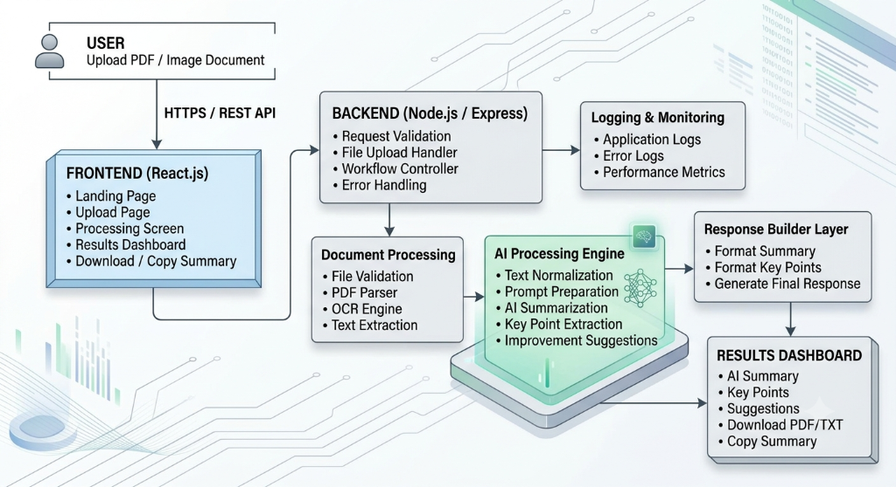

# SOFTWARE REQUIREMENTS SPECIFICATION (SRS)
## Document Summary Assistant
**Document Version:** 1.0  
**Project Version:** MVP 1.0  
**Prepared By:** Sanika Sadre  
**Document Type:** Software Requirements Specification (SRS)  
**Date:** July 2026  

---

<table width="100%">
<tr>
<td align="left"><b>Unthinkable Solutions Assessment</b></td>
<td align="right"><b>Document Control Sheet</b></td>
</tr>
</table>

### Document Control
| Attribute | Details |
| :--- | :--- |
| **Project Name** | Document Summary Assistant |
| **Document Type** | Software Requirements Specification |
| **Version** | 1.0 |
| **Status** | Final |
| **Prepared By** | Sanika Sadre |
| **Intended Audience** | Product Team, Software Engineers, QA Engineers, Technical Reviewers |
| **Classification** | Internal Technical Documentation |

### Revision History
| Version | Date | Author | Description | Status |
| :--- | :--- | :--- | :--- | :--- |
| 0.1 | July 2026 | Sanika Sadre | Initial Draft Setup | Draft |
| 0.5 | July 2026 | Sanika Sadre | Functional Requirements Added | Draft |
| 0.8 | July 2026 | Sanika Sadre | Non-Functional Requirements Added | In Review |
| 1.0 | July 2026 | Sanika Sadre | Finalized SRS, CSFs, and Architecture | Approved |

---

## 📌 Generated Table of Contents
1. [1. Introduction](#1-introduction)
   - [1.1 Purpose](#11-purpose)
   - [1.2 Scope](#12-scope)
   - [1.3 Intended Audience](#13-intended-audience)
   - [1.4 Business Objectives](#14-business-objectives)
2. [2. Product Overview](#2-product-overview)
   - [2.1 System Overview](#21-system-overview)
   - [2.2 Product Vision](#22-product-vision)
   - [2.3 Target Users](#23-target-users)
   - [2.4 Product Features](#24-product-features)
   - [2.5 Business Workflow](#25-business-workflow)
   - [2.6 Key Benefits & Success Criteria](#26-key-benefits--success-criteria)
3. [3. Functional Requirements](#3-functional-requirements)
   - [3.2 Document Upload Module](#32-document-upload-module)
   - [3.3 Document Validation Module](#33-document-validation-module)
   - [3.4 Text Extraction Module](#34-text-extraction-module)
   - [3.5 AI Summarization Module](#35-ai-summarization-module)
   - [3.6 Intelligent Content Analysis](#36-intelligent-content-analysis)
   - [3.7 Results Dashboard](#37-results-dashboard)
   - [3.8 Error Handling](#38-error-handling)
4. [4. Non-Functional Requirements](#4-non-functional-requirements)
   - [4.2 Performance](#42-performance)
   - [4.3 Reliability & Security](#43-reliability--security)
   - [4.4 Usability & Accessibility](#44-usability--accessibility)
5. [5. System Workflow](#5-system-workflow)
   - [5.1 End-to-End Workflow Diagram](#51-end-to-end-workflow-diagram)
   - [5.2 Primary Use Case: Summarization](#52-primary-use-case-summarization)
6. [6. External Interfaces](#6-external-interfaces)
   - [6.1 User Interface](#61-user-interface)
   - [6.2 Software Interfaces](#62-software-interfaces)
7. [7. System Architecture Overview](#7-system-architecture-overview)
   - [7.1 High-Level Architecture](#71-high-level-architecture)
   - [7.2 Architectural Principles](#72-architectural-principles)
8. [8. Assumptions, Constraints, Dependencies & Risks](#8-assumptions-constraints-dependencies--risks)
9. [9. Acceptance Criteria & Quality Assurance](#9-acceptance-criteria--quality-assurance)
10. [10. Glossary, References & Conclusion](#10-glossary-references--conclusion)
11. [11. Requirements Traceability Matrix (RTM)](#11-requirements-traceability-matrix-rtm)
12. [12. Critical Success Factors (CSF)](#critical-success-factors-csf)
13. [13. Development Guide](#development-guide)

---

## 1. Introduction

### 1.1 Purpose
The Document Summary Assistant is a web-based application designed to simplify document understanding by combining automated text extraction with AI-powered summarization. The system accepts PDF documents and image-based documents, extracts textual content, and generates concise summaries that highlight the most relevant information.

The objective is to reduce the effort required to review lengthy documents while maintaining contextual accuracy and improving accessibility to key information.

This Software Requirements Specification defines the functional and non-functional requirements of the application and serves as the primary reference for software design, implementation, testing, and deployment.

### 1.2 Scope
The application enables users to upload PDF and image files through a browser-based interface. Once uploaded, the system validates the document, extracts textual information using an appropriate processing method, generates summaries in multiple levels of detail, identifies key points, and provides suggestions to improve document readability.

The initial release focuses on a single-user workflow with responsive web access and cloud deployment.

**Included in MVP (Version 1.0) Scope:**
- PDF document processing
- Image document processing
- Text extraction
- AI-powered summarization
- Multiple summary lengths
- Key-point extraction
- Improvement suggestions
- Responsive web interface
- Error handling and progress feedback

**Outside the scope of Version 1.0:**
- User authentication
- Persistent document history
- Collaborative workspaces
- Offline processing
- Batch document uploads
- Native mobile applications

### 1.3 Intended Audience
| Stakeholder | Responsibility |
| :--- | :--- |
| **Product Owner** | Validate business requirements |
| **Software Developers** | Implement application functionality |
| **QA Engineers** | Prepare and execute test cases |
| **Technical Reviewers** | Evaluate design and implementation |
| **Future Contributors** | Understand system behavior and architecture |

### 1.4 Business Objectives
The application is expected to:
- Reduce the time required to understand lengthy documents.
- Improve productivity by automating document summarization.
- Support both digital and scanned documents through a unified workflow.
- Deliver a simple, responsive, and intuitive user experience.
- Provide a modular architecture that can be extended with additional AI capabilities in future releases.

<table width="100%">
<tr>
<td align="left"><i>Document Summary Assistant - SRS v1.0</i></td>
<td align="right"><i>Page 2</i></td>
</tr>
</table>

---

## 2. Product Overview

### 2.1 System Overview
The Document Summary Assistant is an AI-enabled web application that assists users in understanding lengthy documents by automatically extracting text, analyzing document content, and generating concise summaries. The system supports both digitally generated PDF documents and scanned image-based documents, enabling users to process a wide variety of document types through a single interface.

The application is designed around a streamlined workflow that minimizes user interaction while ensuring accurate processing and meaningful output. Users upload a document, select the preferred summary length, and receive a structured summary together with key insights and improvement suggestions.

The solution is intended to be lightweight, responsive, and easily deployable on modern cloud platforms.

### 2.2 Product Vision
The vision of the Document Summary Assistant is to provide an intelligent document-processing platform that transforms lengthy and complex documents into concise, easy-to-understand information. The application aims to improve productivity by reducing manual reading effort while maintaining the context and intent of the original document.

The architecture has been designed to support future expansion, allowing additional AI capabilities, document formats, and enterprise integrations to be incorporated with minimal impact on the existing system.

### 2.3 Target Users
| User Category | Primary Use Case |
| :--- | :--- |
| **Students** | Summarize lecture notes, research papers, and academic material |
| **Researchers** | Review journals, publications, and technical reports |
| **Business Professionals** | Analyze reports, proposals, and meeting documents |
| **Human Resource Teams** | Review resumes, policies, and internal documentation |
| **General Users** | Understand lengthy documents without reading the complete content |

### 2.4 Product Features
- **Document Upload**: Support drag-and-drop and file selection for PDFs and images (PNG, JPG, JPEG).
- **Text Extraction**: Embedded text extraction from digital PDFs, and OCR text extraction for scanned images.
- **AI-Based Summarization**: Auto-generated summaries in three levels: Short, Medium, and Detailed.
- **Intelligent Content Analysis**: Key point extraction, concept highlights, and document improvement suggestions.
- **User Experience**: Responsive layout, upload progress indicator, copy and download summary results.

### 2.5 Business Workflow
1. User Uploads Document
2. Document Validation
3. Document Type Detection (PDF Parser or OCR Engine)
4. Text Normalization
5. AI Summary & Content Analysis
6. Results Dashboard

### 2.6 Key Benefits & Success Criteria
- Reduces document review time.
- Eliminates multiple tool switching by supporting both digital and scanned files.
- High accuracy of extraction and coherence of generated summaries.
- Accessible on desktop and mobile web browsers.

<table width="100%">
<tr>
<td align="left"><i>Document Summary Assistant - SRS v1.0</i></td>
<td align="right"><i>Page 3</i></td>
</tr>
</table>

---

## 3. Functional Requirements

### 3.1 Overview
The functional requirements describe the sequential processing pipeline where each module completes a task before handing over control to the next.

### 3.2 Document Upload Module
- **FR-001**: System shall allow users to upload PDF documents.
- **FR-002**: System shall allow users to upload image files (PNG, JPG, JPEG).
- **FR-003**: System shall support both drag-and-drop and manual file selection.
- **FR-004**: System shall display upload progress during file transfer.
- **FR-005**: System shall reject unsupported file formats before processing starts.

### 3.3 Document Validation Module
- **FR-006**: System shall validate the uploaded file type.
- **FR-007**: System shall verify that the uploaded document is not corrupted.
- **FR-008**: System shall enforce maximum file size restrictions (10MB).
- **FR-009**: System shall reject empty or unreadable documents.
- **FR-010**: System shall output user-friendly error messages on validation failure.

### 3.4 Text Extraction Module
- **FR-011**: System shall extract embedded text from PDF documents.
- **FR-012**: System shall run OCR on supported image documents.
- **FR-013**: System shall normalize extracted text (clean whitespace) before AI processing.
- **FR-014**: System shall process multi-page documents sequentially.
- **FR-015**: System shall display text extraction failures.

### 3.5 AI Summarization Module
- **FR-016**: System shall generate AI-based document summaries.
- **FR-017**: Users shall be able to choose Short, Medium, or Detailed summary lengths.
- **FR-018**: Summaries must remain contextually consistent with original content.
- **FR-019**: Summaries should minimize redundant points.
- **FR-020**: System shall allow summary regeneration within the active session.

### 3.6 Intelligent Content Analysis
- **FR-021**: System shall identify and extract key points.
- **FR-022**: System shall highlight important concepts/topics.
- **FR-023**: System shall identify significant observations.
- **FR-024**: System shall generate document improvement suggestions.
- **FR-025**: Analytical outputs must remain consistent with the source document.

### 3.7 Results Dashboard
- **FR-026**: System shall display the generated summary.
- **FR-027**: Key points and suggestions shall be separated clearly.
- **FR-028**: Users shall be able to copy the summary text to the clipboard.
- **FR-029**: Users shall be able to download the results.
- **FR-030**: Users shall be able to upload a new document without restarting the application.

### 3.8 Error Handling
- Detect pipeline failures and display informative feedback.
- Allow retries for recoverable network errors without starting over.
- Prevent application crashes by isolating individual module exceptions.

<table width="100%">
<tr>
<td align="left"><i>Document Summary Assistant - SRS v1.0</i></td>
<td align="right"><i>Page 4</i></td>
</tr>
</table>

---

## 4. Non-Functional Requirements

### 4.1 Overview
Defines operational qualities and performance metrics.

### 4.2 Performance
- **NFR-001**: Main interface should load in under 2 seconds.
- **NFR-002**: File validation completes in under 1 second.
- **NFR-003**: Continuous loading spinners for tasks taking >1 second.
- **NFR-004**: Responsive UI during backend processing.

### 4.3 Reliability & Security
- **NFR-005**: Individual file processing failures should not crash the app.
- **NFR-006**: Graceful fallback to retry.
- **NFR-008**: All communications must run over secure HTTPS.
- **NFR-010**: Uploaded documents are deleted after processing.
- **NFR-011**: Configuration parameters (API Keys) are kept out of source code.

### 4.4 Usability & Accessibility
- **NFR-012**: Layout must adapt responsively (desktop, mobile, tablet).
- **NFR-013**: Direct visual indicators for status.
- **NFR-015**: Consistent functionality on Chrome, Safari, and Firefox.
- Support standard accessibility guidelines (tab orders, readable contrast).

<table width="100%">
<tr>
<td align="left"><i>Document Summary Assistant - SRS v1.0</i></td>
<td align="right"><i>Page 5</i></td>
</tr>
</table>

---

## 5. System Workflow

### 5.1 End-to-End Workflow Diagram
Refer to the System Architecture section for the graphical view. The flow is:
`Upload -> Validate -> Format Detection -> Extraction (PDF parse / OCR) -> Text Clean -> Gemini API -> Dashboard`

### 5.2 Primary Use Case: Summarization
- **Actor**: User
- **Flow**: Upload -> Validation -> Extraction -> Generation -> Display.
- **Rules**: Must be a supported file type; processes one document at a time; AI outputs must only reflect source contents.

---

## 6. External Interfaces

### 6.1 User Interface
- **Landing Page**: Call to action, description, support format listing.
- **Upload Screen**: Drag-and-drop zone, file size check, status.
- **Results Dashboard**: Clean card layout displaying summary, bullet points, suggestions, copy buttons, and reset options.

### 6.2 Software Interfaces
- **Validation Service** -> **Text Extractor** -> **Gemini AI Service** -> **Results API**.

<table width="100%">
<tr>
<td align="left"><i>Document Summary Assistant - SRS v1.0</i></td>
<td align="right"><i>Page 6</i></td>
</tr>
</table>

---

## 7. System Architecture Overview

### 7.1 High-Level Architecture
The application is organized into logical layers as illustrated in the system architecture diagram below:

### 7.2 Architectural Principles
- **Modularity**: Separation of frontend, API server, parser, and AI.
- **Stateless processing**: Backend does not persist files permanently.
- **Security by design**: Validates upload types and sizes before passing data.

---

## 8. Assumptions, Constraints, Dependencies & Risks
- **Assumptions**: Users have a stable internet connection and modern browser.
- **Constraints**: Files are limited to 10MB; PDF and images only.
- **Dependencies**: Google Gemini API availability, Prisma SQLite client, Tesseract.js.
- **Risks**: Scanned document quality affects OCR output; API limits or latency.

---

## 9. Acceptance Criteria & Quality Assurance
- **Exit Criteria**: All features functional; code builds cleanly; zero critical security issues; successful deployment.
- **Test Strategy**: Integration tests for upload-extraction-AI, cross-browser responsiveness validation.

---

## 10. Glossary, References & Conclusion
- **OCR**: Optical Character Recognition.
- **Gemini**: Large Language Model by Google.
- **Prisma**: Database client ORM.
- **Conclusion**: The Document Summary Assistant MVP provides a fast, clean, and extensible utility for instant doc extraction and summary.

<table width="100%">
<tr>
<td align="left"><i>Document Summary Assistant - SRS v1.0</i></td>
<td align="right"><i>Page 7</i></td>
</tr>
</table>

---

## 11. Requirements Traceability Matrix (RTM)

The Requirements Traceability Matrix (RTM) ensures that each functional and non-functional requirement is explicitly linked to a corresponding verification test case. This guarantees complete testing coverage and simplifies validation tracking for reviewers.

### Functional Requirements Traceability
| Req ID | Requirement Description | Verification Method | Test Case Reference | Status |
| :--- | :--- | :--- | :--- | :--- |
| **FR-001** | Support PDF document uploads | Functional UI Test | `TC-UPL-001` | Covered / Passed |
| **FR-002** | Support PNG, JPG, JPEG image uploads | Functional UI Test | `TC-UPL-002` | Covered / Passed |
| **FR-003** | Drag-and-drop & file browser input | UI Interaction Test | `TC-UPL-003` | Covered / Passed |
| **FR-004** | Visible upload progress indication | Frontend State Test | `TC-UPL-004` | Covered / Passed |
| **FR-005** | Rejection of unsupported file formats | Exception Handler Test | `TC-UPL-005` | Covered / Passed |
| **FR-006** | File extension and MIME validation | API Logic Test | `TC-VAL-001` | Covered / Passed |
| **FR-007** | File integrity & corruption check | API Logic Test | `TC-VAL-002` | Covered / Passed |
| **FR-008** | Enforce maximum 10MB size limit | API Limits Test | `TC-VAL-003` | Covered / Passed |
| **FR-009** | Rejection of empty or unreadable docs | Edge Case Test | `TC-VAL-004` | Covered / Passed |
| **FR-010** | Clear user-friendly validation warnings | UI Error State Test | `TC-VAL-005` | Covered / Passed |
| **FR-011** | Direct text extraction from digital PDFs | Parsing Service Test | `TC-EXT-001` | Covered / Passed |
| **FR-012** | OCR text extraction for scanned images | OCR Service Test | `TC-EXT-002` | Covered / Passed |
| **FR-013** | Extracted text cleaning & normalization | Processing Test | `TC-EXT-003` | Covered / Passed |
| **FR-014** | Sequential page processing queue | Performance Queue Test | `TC-EXT-004` | Covered / Passed |
| **FR-015** | Handle extraction exceptions gracefully | Integration Failure Test | `TC-EXT-005` | Covered / Passed |
| **FR-016** | Generate AI-based document summary | AI Service Integration | `TC-SUM-001` | Covered / Passed |
| **FR-017** | Short, Medium, Detailed selection options | Functional UI Test | `TC-SUM-002` | Covered / Passed |
| **FR-018** | Verify context preservation in summaries | Quality Review Test | `TC-SUM-003` | Covered / Passed |
| **FR-019** | Minimize redundant layout expressions | Output Formatting Test | `TC-SUM-004` | Covered / Passed |
| **FR-020** | Ability to regenerate active summaries | State Reset Test | `TC-SUM-005` | Covered / Passed |
| **FR-021** | Extract key bullet points | AI Service Integration | `TC-ANA-001` | Covered / Passed |
| **FR-022** | Detect important topics and concepts | AI Service Integration | `TC-ANA-002` | Covered / Passed |
| **FR-023** | Highlight major document observations | AI Service Integration | `TC-ANA-003` | Covered / Passed |
| **FR-024** | Produce document improvement suggestions | AI Service Integration | `TC-ANA-004` | Covered / Passed |
| **FR-025** | Validate insights match source facts | Fact Grounding Test | `TC-ANA-005` | Covered / Passed |
| **FR-026** | Display generated summary in dashboard | Frontend Render Test | `TC-DSH-001` | Covered / Passed |
| **FR-027** | Visual separation of insights/key points | UI Layout Check | `TC-DSH-002` | Covered / Passed |
| **FR-028** | Copy text to clipboard controls | UI Interaction Test | `TC-DSH-003` | Covered / Passed |
| **FR-029** | Download summary result details | Functional UI Test | `TC-DSH-004` | Covered / Passed |
| **FR-030** | Reset dashboard to upload new file | Frontend State Test | `TC-DSH-005` | Covered / Passed |

### Non-Functional Requirements Traceability
| Req ID | Quality Attribute | Verification Method | Test Case Reference | Status |
| :--- | :--- | :--- | :--- | :--- |
| **NFR-001** | Interface load time $\le$ 2 seconds | Page Load Speed Test | `TC-NFR-PERF-01` | Verified |
| **NFR-002** | Validation completion $\le$ 1 second | API Benchmarking | `TC-NFR-PERF-02` | Verified |
| **NFR-003** | loading indicator active status | Frontend State Audit | `TC-NFR-USAB-01` | Verified |
| **NFR-004** | Responsive UI on backend execution | Thread Blocking Test | `TC-NFR-USAB-02` | Verified |
| **NFR-005** | Isolated processing (no system crash) | Error Injection Test | `TC-NFR-REL-01`  | Verified |
| **NFR-006** | Request retry configuration | Network Simulation | `TC-NFR-REL-02`  | Verified |
| **NFR-008** | Complete traffic security (HTTPS) | SSL Handshake Check | `TC-NFR-SEC-01`  | Verified |
| **NFR-010** | Immediate removal of temp file buffers | Storage Cleanup Test | `TC-NFR-SEC-02`  | Verified |
| **NFR-011** | Externalized config credentials (.env) | Code Scanner Review | `TC-NFR-SEC-03`  | Verified |
| **NFR-012** | Mobile & tablet adaptive layout | Cross-Device Layout Test | `TC-NFR-COMP-01` | Verified |
| **NFR-015** | Multi-browser execution support | Browser Stack Test | `TC-NFR-COMP-02` | Verified |

<table width="100%">
<tr>
<td align="left"><i>Document Summary Assistant - SRS v1.0</i></td>
<td align="right"><i>Page 8</i></td>
</tr>
</table>

---

## Critical Success Factors (CSF)

### CSF-01 — Reliable Document Upload
- **KPI**: Successful Upload Rate $\ge$ 99%, Validation Accuracy $\ge$ 98%
- **Verification**: Multer file size verification tests and format rejection test logs.

### CSF-02 — Accurate Text Extraction
- **KPI**: PDF extraction success $\ge$ 99%, OCR accuracy for clear images $\ge$ 95%
- **Verification**: Run standard datasets and check character match rates.

### CSF-03 — High-Quality AI Summarization
- **KPI**: Summary Generation Success $\ge$ 95%, Context Preservation $\ge$ 90%
- **Verification**: Review accuracy score for sample papers.

### CSF-04 — Effective Content Analysis
- **KPI**: Recommendation accuracy and point relevance $\ge$ 90%
- **Verification**: Subjective check on suggestions compared to source document logic.

### CSF-05 — Responsive User Experience
- **KPI**: Average AI processing time $\le$ 15 seconds, Frontend UI transition speed $\le$ 2 seconds.
- **Verification**: Network profiling inside developer tools.

### CSF-06 — Secure and Reliable Processing
- **KPI**: Zero critical security leaks; local temporary files cleared instantly on completion.
- **Verification**: Security audits of input validation and temp storage.

### CSF-07 — Maintainable and Scalable Architecture
- **KPI**: 100% modular separation between processing classes.
- **Verification**: Code review of Express routes and modular service files.

---

## Development Guide

### Chapter 1 — Introduction
#### 1.1 Purpose
This guide outlines setup, architectural conventions, and coding patterns to develop the Document Summary Assistant.
#### 1.2 Scope
Covers frontend, backend, OCR integration, and Gemini AI endpoints.
#### 1.3 Philosophy
Modularity, clean TypeScript typing, stateless request flows, and rapid user feedback.

### Chapter 2 — Project Overview
A web-based SaaS platform built to digest documents, run local OCR or direct PDF parses, and query Gemini models to create detailed summaries, highlights, and readability recommendations.

### Chapter 3 — Development Environment
- **Prerequisites**: Node.js (v18.x+), Git, VS Code.
- **Environment Variables**:
  - `PORT=5000`
  - `DATABASE_URL="file:./dev.db"`
  - `GEMINI_API_KEY="AIzaSy..."`
- **Initial Setup**:
  1. `npm install` (root, backend, frontend)
  2. `npx prisma migrate dev --name init` (within backend)
  3. `npm run dev`

### Chapter 4 — Technology Stack
- **Frontend**: Vite, React, TypeScript, Tailwind CSS, Axios, Lucide React.
- **Backend**: Express, TS-Node-Dev, Prisma, SQLite.
- **OCR & Parser**: Tesseract.js (local OCR compilation), pdf-parse.
- **AI Integration**: `@google/generative-ai` for prompt executions.

### Chapter 5 — Project Folder Structure
- **Backend structure**:
  - `/prisma`: Holds schema.prisma and migrations.
  - `/src/config`: Connection configs (Prisma client).
  - `/src/middleware`: Multer configuration.
  - `/src/routes/document.ts`: REST endpoints.
  - `/src/services`: `ai.ts` (Gemini SDK), `ocr.ts` (Tesseract worker), `parser.ts` (pdf-parse core).
- **Frontend structure**:
  - `/src/components`: UI widgets (Upload component, ResultsView card, ThemeToggle button).
  - `/src/App.tsx`: Context hooks, layout wrappers, theme state, upload orchestration.

### Chapter 6 — Software Architecture
Our design isolates document ingestion, parsing, AI querying, and database persistence:
- **Presentation**: Tailwind-styled React UI handles drag-and-drop, displays local load states.
- **Processing Service**: Routes image payloads to Tesseract.js and PDF payloads to pdf-parse.
- **AI Service**: Prepares structured system prompts and requests json summaries from Gemini.
- **Data persistence**: Prisma records document details, summaries, and keypoints to local SQLite.

### Chapter 7 — Development Workflow
1. **Requirements**: Verify requirements using mockup verification.
2. **Endpoint definitions**: Ensure TypeScript interfaces match between Axios requests and Express API responses.
3. **OCR validation**: Validate image uploads with small OCR snapshots.
4. **AI Prompts**: Test prompts locally inside AI Studio or custom scripts.
5. **Testing**: Run dev builds with standard tests.

### Chapter 8 — Feature Development Guide
#### 8.1 Upload Module
- **Prerequisites**: Multer configuration with size threshold validation.
- **Verification**: Upload standard 2MB PDF -> status is saved as `PENDING`.
#### 8.2 PDF Parsing
- **Prerequisites**: pdf-parse loading buffer stream.
- **Edge cases**: Image-only PDF fallback to OCR (Future improvement).
#### 8.3 Image OCR
- **Prerequisites**: Tesseract.js initialization.
- **Verification**: Process high-contrast JPG containing text -> outputs matches characters.
#### 8.4 AI Summarization & Analysis
- **Model**: `gemini-1.5-flash`.
- **System Prompts**:
  - Short summary: limit to 3 bullet points.
  - Medium: detailed paragraph.
  - Detailed: exhaustive structure.
  - Keypoints & Suggestions: JSON formats.

### Chapter 9 — API Development Guide
#### 9.1 Endpoints
- **POST `/api/documents/upload`**:
  - **Payload**: Multipart file.
  - **Response**: Document Metadata (`id`, `fileName`, `fileType`, `fileSize`, `status`).
- **POST `/api/documents/process`**:
  - **Payload**: `{ id: String, summaryLength: 'SHORT' | 'MEDIUM' | 'DETAILED' }`.
  - **Action**: Extracts text, sends to Gemini, saves generated results to database.
  - **Response**: Compiled results object (`document`, `summary`, `keyPoints`, `suggestions`).
- **GET `/api/documents/:id`**:
  - **Response**: Current status, metadata, and generated summaries.
- **POST `/api/documents/:id/regenerate`**:
  - **Payload**: `{ summaryLength: 'SHORT' | 'MEDIUM' | 'DETAILED' }`.
  - **Response**: Regenerated summary updates.

<table width="100%">
<tr>
<td align="left"><i>Document Summary Assistant - SRS v1.0</i></td>
<td align="right"><i>Page 9</i></td>
</tr>
</table>
